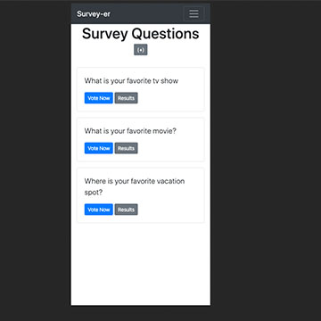

# Survey-er

## About this project

I created a simple survey app that will store individual surveys in a database and allow full CRUD functionality on the surveys.

Resources used: =

- https://docs.djangoproject.com/en/2.2/intro/tutorial01/
- Various Traversy Media YouTube tutorials for Bootstrap and Django
- Significant research into docs.djangoproject.com to implement advanced Django features

## Features

- Configured admin with admin urls inserted throughout the project ie: admin_survey_choice_add to create choices for the survey questions.
- Included a partial file for the navbar: \_navbar.html
- Created a separate 'pages' app for the home index route of the app. Used app namespace (app_name='pages') to add a link to the homepage in the navbar, which is accessible anywhere in the program.

## Technologies used

- Python
- Django/Templates
- PostgreSQL
- Deployed with Heroku

## Features still working on

Working through the rest of the django documentation tutorial to add testing
